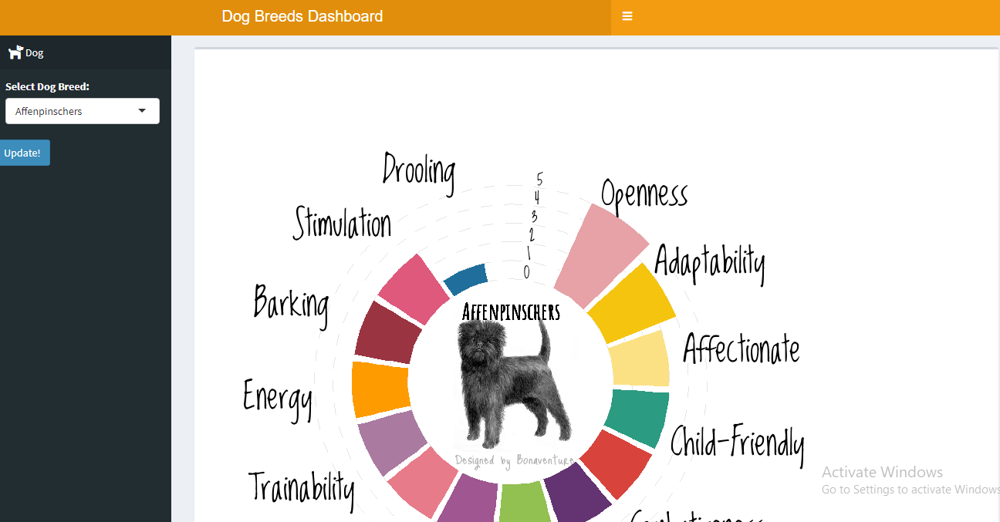

# Dascot_Test
This repository contains a shiny dashboard for dog breeds.
The picture below shows the graphical user interface of the dashboard.

# Usage 
Used the tidyverse packages for data manipulation and visualization.
To use the dashboard, one needs to click on the select dog breed then update for the visual to take effect.

# Deployment
I deployed the dashboard using the shinyapps.ios and the dashboard can be accessed using the link below.

[Dog breed Dashboard]()
